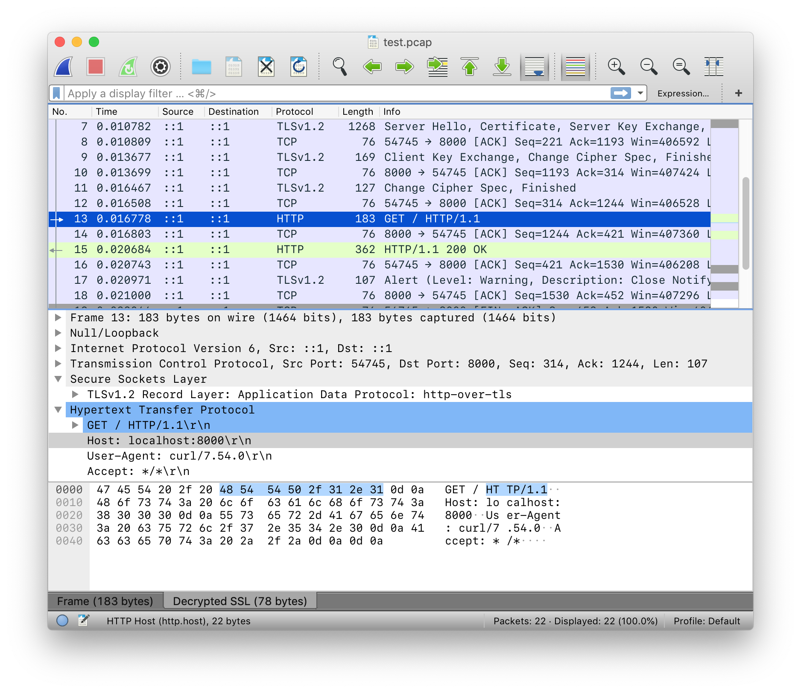

# node-sslkeylog

**sslkeylog** is Node.js module for generating server-side SSLKEYLOG, which can be used later by Wireshark to decrypt SSL connections. This method works with any TLS cipher suite including elliptic curves crypto.

Further reading about SSLKEYLOG:

* [SSL/TLS Decryption: uncovering secrets](https://sharkfesteurope.wireshark.org/assets/presentations17eu/15.pdf) (PDF, SharkFest'17)
* [Decrypting TLS browser traffic with Wireshark: the easy way](https://jimshaver.net/2015/02/11/decrypting-tls-browser-traffic-with-wireshark-the-easy-way/)

### Installation

[Node.js](https://nodejs.org/) v10+ is required. Tested on v10 (LTS) and v11 (CURRENT), OS X and Linux.

To use in your project, install as usual:

```$ npm install sslkeylog```

...or add to `package.json` and use npm/yarn to do the work.

For dev environment, clone the repository first:

```sh
$ git clone https://github.com/kolontsov/node-sslkeylog
$ cd node-sslkeylog
$ npm install
...
$ cd examples
```

### Usage

When you have connected `TLSSocket`, you may call `get_sesion_key()` to get session key for this connection:

```javascript
let server = https.createServer({key, cert});
server.on('secureConnection', tls_socket=>{
    const {client_random, master_key} = sslkeylog.get_session_key(tls_socket);
    const hex1 = client_random.toString('hex');
    const hex2 = master_key.toString('hex');
    fs.appendFileSync('/tmp/sslkeylog.txt', `CLIENT_RANDOM ${hex1} ${hex2}\n`);
};
``` 

Or just use `set_log()` and `update_log()` to do exactly the same:

```javascript
sslkeylog.set_log('sslkeylog.txt');
server = https.createServer({key, cert});
server.on('secureConnection', sslkeylog.update_log);
```

### Demo

Clone the repository, build with `npm install` and go to `examples/` subdir. Open few terminal tabs or tmux/screen windows.

1. 1st terminal: `make server` (starts https server on port 8000)
2. 2nd terminal: `make capture` (starts tcpdump on loopback-interface, port 8000)
3. 3rd terminal: `make req` (curl https://localhost:8000)
4. Stop https server and tcpdump.

Now you have `sslkeylog.txt` (written by https server) and `test.pcap` (written by tcpdump).

Open `test.pcap` in Wireshark, right-click on any TLS packet, choose *Protocol Preferences &rarr; Open Secure Sockets Layer Preferences &rarr; (Pre)-Master-Secret log filename* and fill full path to to `sslkeylog.txt`

Now you can see decrypted packets:



### TODO

- windows support?

### Bugs

Not tested on production, use on your own risk. Issues/PRs are welcome.

### License

MIT
